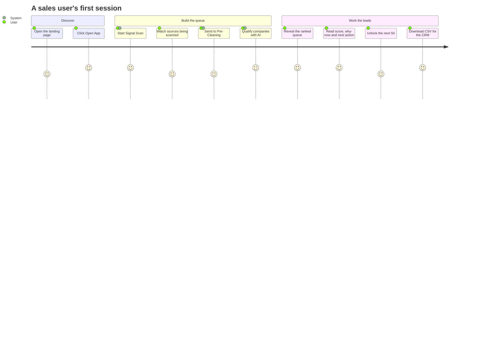
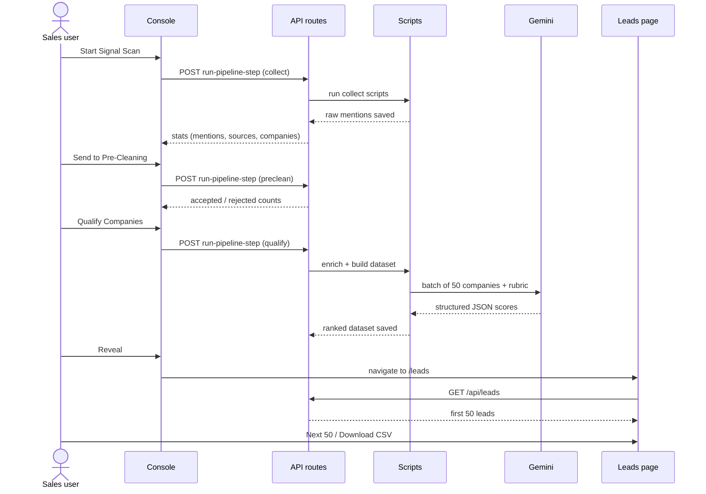
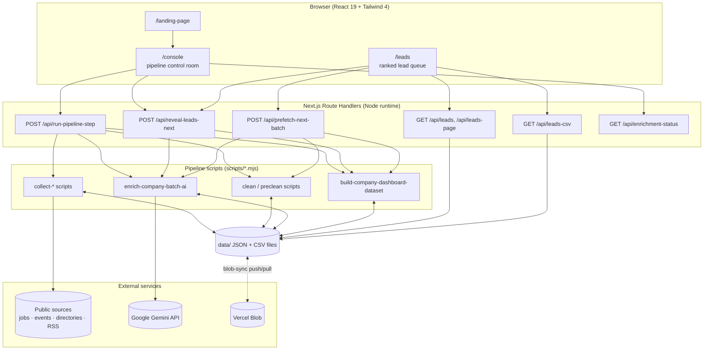
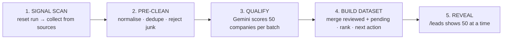
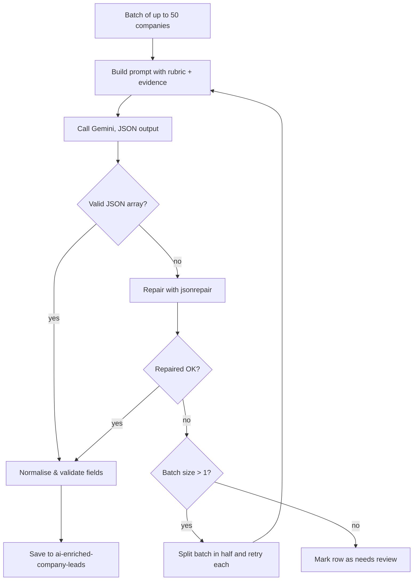
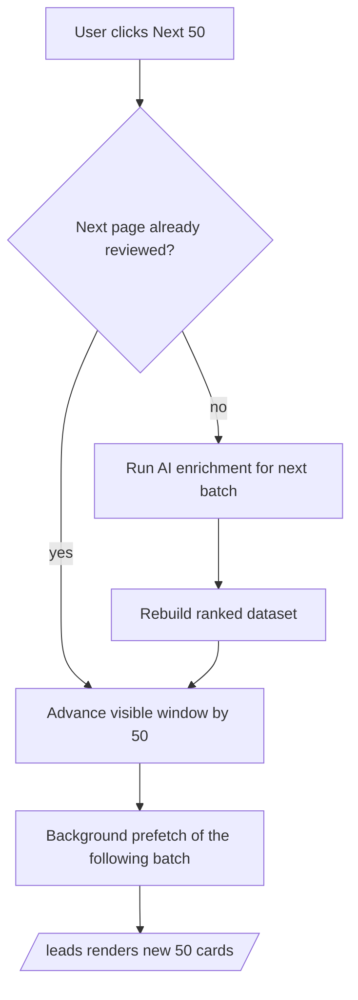

<div align="center">

# LeadGrid — Lead Signal Intelligence

**Turn noisy public signals into a short, ranked, explainable list of companies that are ready to buy right now.**


</div>

---

## 🔗 Live Demo

> **Live link: _coming soon_**
>
> `https://your-live-link-here`

---

## 📑 Table of Contents

1. [Run it locally](#-run-it-locally)
2. [The problem & the solution](#-the-problem--the-solution)
3. [Use cases](#-use-cases)
4. [User journey](#-user-journey)
5. [System architecture](#-system-architecture)
6. [Data pipeline & flowcharts](#-data-pipeline--flowcharts)
7. [Scoring model](#-scoring-model)
8. [Key features](#-key-features)
9. [Screens](#-screens)
10. [API reference](#-api-reference)
11. [Tech stack](#-tech-stack)
12. [Project structure](#-project-structure)
13. [Configuration](#-configuration)
14. [Deploying to Vercel](#-deploying-to-vercel)
15. [Troubleshooting](#-troubleshooting)
16. [Limitations & future scope](#-limitations--future-scope)
17. [Contributing](#-open-to-contribution)

---

## 🚀 Run it locally

### Prerequisites

| Requirement | Notes |
|---|---|
| **Node.js 20+** and npm | Check with `node -v` |
| **A Gemini API key** | Free, no credit card: get one at <https://aistudio.google.com/apikey> |
| Git | To clone the repo |

### Steps

**1. Clone the repository**

```bash
git clone https://github.com/iiabhi/Lead-Generation-Project.git
cd Lead-Generation-Project
```

**2. Install dependencies**

```bash
npm install
```

**3. Create your environment file**

```bash
cp .env.example .env.local
```

**4. Add your Gemini key** — open `.env.local` and fill in:

```env
GEMINI_API_KEY=your_key_here
GOOGLE_API_KEY=your_key_here
GOOGLE_GENERATIVE_AI_API_KEY=your_key_here
NEXT_PUBLIC_APP_URL=http://localhost:3000
GEMINI_MODEL=gemini-2.5-flash-lite
```

> For local use, leave `LEADGRID_DATA_DIR` commented out (data is written to `./data`) and ignore `BLOB_READ_WRITE_TOKEN`. Both are only for Vercel.

**5. (Optional) Verify your key works**

```bash
node scripts/test-gemini-one-row.mjs
```

**6. Start the dev server**

```bash
npm run dev
```

**7. Open the app** at **<http://localhost:3000>**, then go to **`/console`** and click through:

`Start Signal Scan` → `Send to Pre-Cleaning` → `Qualify Companies` → `Reveal`

> Next.js only reads `.env.local` on startup. Restart `npm run dev` after editing it.

### Useful commands

| Command | What it does |
|---|---|
| `npm run dev` | Start the dev server on port 3000 |
| `npm run build` | Production build |
| `npm start` | Serve the production build |
| `npm run lint` | Run ESLint |
| `node scripts/reset-live-run.mjs` | Clear the current run's data |

---

## 🎯 The Problem & the Solution

### The problem

Outbound sales teams and appointment-setting agencies spend most of their time *finding* leads rather than *talking* to them:

- Paid lead lists are stale and generic — everyone buys the same list.
- Buying signals (hiring SDRs, sponsoring a SaaS conference, raising funding) are scattered across dozens of public sites.
- Raw scraped data is full of garbage: navigation labels, job titles, duplicates, recruiters and agencies that aren't real buyers.
- Reps get no explanation of *why* a lead is good or *what to say* to them.

### The solution

LeadGrid runs a three-stage pipeline — **Scan → Pre-Clean → Qualify** — and presents a prioritised queue where every lead comes with:

| Output | Example |
|---|---|
| Intent score (0–100) | `88` |
| Decision tier | `hot_lead` |
| ICP fit & confidence | `high`, `82%` |
| Why now | "Hiring 3 SDRs and sponsoring SaaStr" |
| Recommended buyer | "VP Sales / Head of Growth" |
| Next action | "Find VP Sales and test the appointment-setting pitch" |

It is tuned for one seller persona: a company offering **appointment setting, SDR support, lead generation and outbound infrastructure**.

---

## 💼 Use Cases

### Who uses it

| User | What they do with LeadGrid |
|---|---|
| **SDR / BDR** | Works the hot leads from the top each morning instead of researching from scratch. |
| **Sales manager** | Checks score breakdowns and reasoning to trust the prioritisation and assign accounts. |
| **Agency founder** | Finds startups that *just* started hiring sales roles — when they're most open to outsourced outbound. |
| **Growth / marketing analyst** | Exports the queue to CSV for a CRM or outreach tool. |
| **Student / researcher** | Studies how LLMs, scraping and rule-based filtering combine in a real data product. |

### Scenarios

| # | Scenario | How LeadGrid helps |
|---|---|---|
| UC-1 | **Find companies hiring sales roles** | Pulls job posts from Hacker News "Who is Hiring", RemoteOK, Remotive, Arbeitnow, Jobicy and Adzuna, and keeps the hiring evidence attached. |
| UC-2 | **Catch companies investing in growth events** | Scrapes sponsor/exhibitor pages of SaaStr, Web Summit and similar events. |
| UC-3 | **Discover early-stage startups early** | Uses the Y Combinator directory, Product Hunt and open RSS feeds. |
| UC-4 | **Filter out fake "leads"** | Pre-clean and the AI rubric strip event labels, job titles, job boards, recruiters and agencies. |
| UC-5 | **Explain why a lead is worth calling** | Every lead has a score breakdown and plain-English reasoning. |
| UC-6 | **Work the queue in batches** | Reveals 50 leads at a time; "Next 50" triggers another AI batch when needed. |
| UC-7 | **Hand off to other tools** | One-click CSV export. |

### Use-case diagram


---

## 🧭 User Journey



### Step-by-step sequence



---

## 🏗️ System Architecture

### High-level view



### Layers

| Layer | Responsibility | Where |
|---|---|---|
| **Presentation** | Landing page, pipeline console with live progress, lead queue with score breakdown | `app/landing-page`, `app/console`, `app/leads`, `components/LeadDashboard.tsx` |
| **API** | Thin HTTP layer: run a step, return paged leads, advance the reveal state, export CSV | `app/api/*/route.ts` |
| **Orchestration** | Spawns pipeline scripts as child processes with timeouts | `lib/run-local-script.ts` |
| **Pipeline workers** | Collect, clean, enrich and build the dataset | `scripts/*.mjs` |
| **Domain logic** | Typed models, identity resolution, rule-based qualification and intent scoring | `types/company.ts`, `lib/identity.ts`, `lib/qualification.ts`, `lib/intent.ts` |
| **Persistence** | Flat JSON/CSV files, optionally mirrored to Vercel Blob | `data/`, `scripts/blob-sync.mjs`, `scripts/data-dir.mjs` |

### Design decisions

- **File-based storage, no database.** A POC has one user and one run at a time. JSON/CSV files are inspectable and need no setup; Blob sync covers deployment.
- **Scripts behind API routes.** Each stage is an independent, re-runnable script that can also be run from the terminal, which makes debugging and demos easy.
- **LLM for judgement, rules for hygiene.** Rules cheaply and deterministically remove obvious junk; the LLM handles "is this a real buyer that needs outbound help?".
- **Step-by-step API.** The console calls one stage at a time so each fits serverless time limits and the UI can show real progress.

---

## 🔄 Data Pipeline & Flowcharts

### End-to-end pipeline



| Stage | Input | What happens | Output |
|---|---|---|---|
| **1. Signal Scan** | Public sites & APIs | New `runId`, old results cleared; sources collected as *raw mentions* | `real-source-mentions.json` |
| **2. Pre-Clean** | Raw mentions | Drops missing/short names, exact duplicates, event/navigation labels and rows with no evidence. Rejected rows are kept for audit. | `…-preclean.json`, `…-rejected-preclean.json` |
| **3. Qualify** | Clean mentions grouped by company | Gemini resolves the real entity, extracts signals, scores against the rubric, and assigns decision, why-now, buyer and next action | `ai-enriched-company-leads.json` |
| **4. Build dataset** | AI results + unreviewed companies | Reviewed leads ranked by score; pending leads get a heuristic score (capped at 60); trash removed | `company-dashboard-leads.json` |
| **5. Reveal** | Ranked dataset | Shows the first 50; "Next 50" unlocks more and pre-fetches the next AI batch | `leadgrid-visible-state.json` |

### AI batch with recursive retry



### Reveal flow (Next 50)



### Decision tiers

| Tier | Meaning | Typical score |
|---|---|---|
| 🔥 `hot_lead` | Clear need, strong evidence, good ICP fit — contact now | ≥ 85 and confidence ≥ 70 |
| `warm_lead` | Useful evidence, worth outreach | 70–84 |
| `nurture` | Possible fit, keep warm | 45–69 |
| `research_more` | Weak or incomplete evidence | < 45 |
| `not_relevant` / `trash` | Real but wrong buyer, or not a company | hidden from the queue |

### Signal sources

| Category | Sources |
|---|---|
| **Jobs** | Hacker News "Who is Hiring", RemoteOK, Remotive, Arbeitnow, Jobicy, Adzuna |
| **Events** | SaaStr Annual, Web Summit partner pages, other SaaS conference sponsor pages |
| **Startup directories** | Y Combinator directory, Product Hunt |
| **Open RSS feeds** | Funding/startup feeds listed in `data/open-lead-rss-sources.json` |

---

## 📊 Scoring Model

```text
intentScore =  icpFit            (0–25)
             + outboundNeed      (0–25)
             + growthTrigger     (0–20)
             + evidenceQuality   (0–15)
             + urgency           (0–10)
             + buyerClarity      (0–5)
             + negativePenalty   (0 to −40)
             → clamped to 0–100
```

The model also returns a separate **confidence** (0–100): direct strong evidence (80+), partial (50–79), weak (20–49), likely bad entity (<20). A lead is only "hot" when score **and** confidence clear their thresholds.

The repo also keeps an earlier **rule-based** baseline (`lib/qualification.ts`, `lib/intent.ts`): keyword checks for B2B/SaaS/sales motion, SDR/AE/VP Sales hiring, funding, event and accelerator presence, multi-source validation and recency.

---

## ✨ Key Features

| # | Feature | Why it matters |
|---|---|---|
| 1 | **Multi-source collection** | 10+ public sources, no paid data, no single point of failure. |
| 2 | **Two-layer filtering** | Cheap rules remove junk *before* spending LLM tokens. |
| 3 | **Transparent rubric** | A fixed 0–100 rubric makes scores explainable and consistent. |
| 4 | **Score vs. confidence** | A high score with low confidence is not treated as hot. |
| 5 | **Strict ICP guardrails** | Agencies, staffing firms, job boards and B2C brands are demoted. |
| 6 | **Structured LLM output** | JSON schema prompt, `jsonrepair`, then validation — the UI never trusts raw model text. |
| 7 | **Batching with recursive retry** | Failed batches are split and retried to isolate bad rows. |
| 8 | **Fresh-run guarantee** | Every scan gets a new `runId` and clears old results. |
| 9 | **Paginated reveal** | Keeps the UI focused and spreads LLM cost over time. |
| 10 | **Pending leads stay visible** | Unreviewed companies show after reviewed ones, so the queue never collapses. |
| 11 | **Dual storage** | Local `data/` in development; Vercel Blob in production. |
| 12 | **Live pipeline console** | Stepper, per-source progress, animated progress bar and a terminal-style log. |
| 13 | **Modern 3D UI** | Clean SaaS look with tactile 3D buttons and dark/light mode. |

---

## 🖥️ Screens

| Route | Purpose |
|---|---|
| `/` | Redirects to `/landing-page` |
| `/landing-page` | Product introduction with an **Open App** call-to-action |
| `/console` | Control room: **Start Signal Scan → Pre-Cleaning → Qualify → Reveal**, with live counters per stage |
| `/leads` | Ranked lead cards (score, tier, reasoning, buyer, next action), **Next 50**, **Download CSV** |

---

## 🔌 API Reference

| Endpoint | Purpose |
|---|---|
| `POST /api/run-pipeline-step` | Runs one stage: `collect_sources`, `collect_extra`, `collect_saas`, `preclean`, `qualify` |
| `GET /api/leads`, `GET /api/leads-page` | Returns the visible / paged lead queue |
| `POST /api/reveal-leads-next` | Unlocks the next 50 leads (runs another AI batch if needed) |
| `POST /api/prefetch-next-batch` | Background pre-clean + enrich + build, guarded by a lock file |
| `GET /api/enrichment-status` | Progress of the AI review |
| `GET /api/leads-csv` | CSV export of the queue |

Legacy single-purpose routes `run-signal-scan`, `run-preclean`, `run-qualification` and `enrich-next-batch` are also present.

---

## 🧰 Tech Stack

| Area | Technology |
|---|---|
| Framework | Next.js 16 (App Router, Route Handlers), React 19 |
| Language | TypeScript, Node.js ESM scripts |
| Styling | Tailwind CSS 4, Geist font |
| AI | Google Gemini via `@google/genai` |
| Data handling | PapaParse (CSV), jsonrepair, Zod |
| Storage | Local JSON/CSV files, Vercel Blob (`@vercel/blob`) |
| Hosting | Vercel |

---

## 🗂️ Project Structure

```text
Leadgrid/
├── app/
│   ├── landing-page/      # marketing entry page
│   ├── console/           # pipeline control room
│   ├── leads/             # lead queue UI
│   ├── api/               # route handlers
│   └── globals.css        # design tokens + 3D button styles
├── components/            # LeadDashboard
├── lib/                   # qualification, intent, identity, script runner
├── scripts/               # collectors, cleaners, AI enrichment, dataset builder, blob sync
├── types/                 # shared TypeScript models
├── data/                  # generated JSON/CSV (per run)
├── docs/TECHNICAL_NOTES.md
└── vercel.json            # function maxDuration
```

---

## ⚙️ Configuration

| Variable | Purpose |
|---|---|
| `GEMINI_API_KEY` (also `GOOGLE_API_KEY`, `GOOGLE_GENERATIVE_AI_API_KEY`) | Gemini access for AI qualification |
| `GEMINI_MODEL` / `AI_MODEL` | Model selection (scripts default to `gemini-2.5-flash-lite`) |
| `AI_API_KEY` | Overrides `GEMINI_API_KEY` in the enrichment script |
| `NEXT_PUBLIC_APP_URL` | Public URL of the app |
| `LEADGRID_DATA_DIR` | Where pipeline files are written. Defaults to `./data` locally and `/tmp/leadgrid-data` on Vercel |
| `BLOB_READ_WRITE_TOKEN`, `LEADGRID_BLOB_PREFIX` | Vercel Blob persistence in production |

> Never commit `.env.local`. It is gitignored.

---

## ☁️ Deploying to Vercel

1. Push the repo to GitHub.
2. In Vercel: **Add New → Project**, import the repo (Next.js is auto-detected).
3. Add the environment variables from the table above (`GEMINI_API_KEY`, `GEMINI_MODEL`, `LEADGRID_DATA_DIR=/tmp/leadgrid-data`, `LEADGRID_BLOB_PREFIX`).
4. **Deploy**, then set `NEXT_PUBLIC_APP_URL` to your new URL and redeploy.
5. Under **Storage**, create a **Blob** store and connect it to the project. This adds `BLOB_READ_WRITE_TOKEN`.

**Free-tier note:** Hobby functions time out at 60 seconds (`vercel.json` sets `maxDuration: 60`). Long enrichment runs may not fit. A practical approach is to run the heavy pipeline locally, push the data to Blob, and use the deployed site to browse leads.

---

## 🩺 Troubleshooting

| Problem | Fix |
|---|---|
| `Missing AI_API_KEY in .env.local` | Add `GEMINI_API_KEY` to `.env.local` and restart `npm run dev`. |
| `429` / quota exceeded | You hit the free Gemini rate limit. Wait a minute or reduce batch size. |
| `/leads` is empty | Run the pipeline from `/console`, or make sure `data/company-dashboard-leads.json` exists. |
| Env changes not applied | Restart the dev server. |
| Port 3000 in use | Next.js picks the next free port and prints it in the terminal. |
| Stuck "enrichment already running" | Delete `data/.ai-enrichment.lock` and `data/.ai-prefetch.lock`. |
| Pipeline times out on Vercel | Hobby plan limit. Run locally or upgrade. |

---

## 🚧 Limitations & Future Scope

**Current limitations**
- Single-user, single-run design; no authentication or multi-tenant storage.
- Flat files instead of a database; concurrent runs are guarded only by lock files.
- Scrapers depend on public page structure and may break when sites change.
- Lead quality depends on LLM judgement; there is no human feedback loop yet.
- Only contact *roles* are recommended, not individual contacts.

**Future scope**
- Postgres with per-user workspaces and saved run history.
- Contact enrichment and CRM integrations (HubSpot, Salesforce).
- Feedback loop: reps mark leads won/lost to calibrate the rubric.
- Scheduled scans and alerts when a watched company shows a new signal.
- Configurable ICP so other sellers can reuse the engine.
- Support for other LLM providers (Groq, OpenRouter, Mistral).

More implementation detail (file-by-file behaviour, data files, route internals) is in [`docs/TECHNICAL_NOTES.md`](docs/TECHNICAL_NOTES.md).

---

## 🤝 Open to Contribution

LeadGrid is open to contributions of every size — bug fixes, new signal sources, UI polish, docs, tests or ideas.

1. **Fork** the repo and create a branch: `git checkout -b feature/your-idea`
2. Make your change and run `npm run lint` and `npm run build`.
3. **Commit** with a clear message and **open a Pull Request** describing what and why.

Good first contributions:
- Add a new signal source in `scripts/`.
- Add support for another LLM provider.
- Replace `any` types in `app/api/*` (there are currently lint errors for this).
- Add tests for `lib/identity.ts` and `lib/qualification.ts`.

Found a bug or have a suggestion? Please open an issue.

---

<div align="center">

**Made by Abhi ❤️**

</div>
