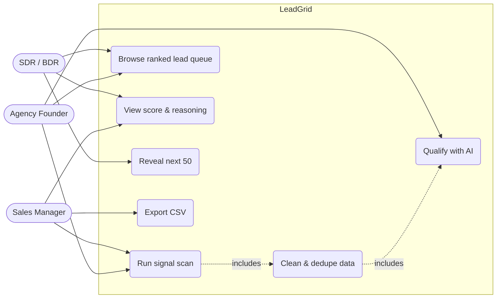
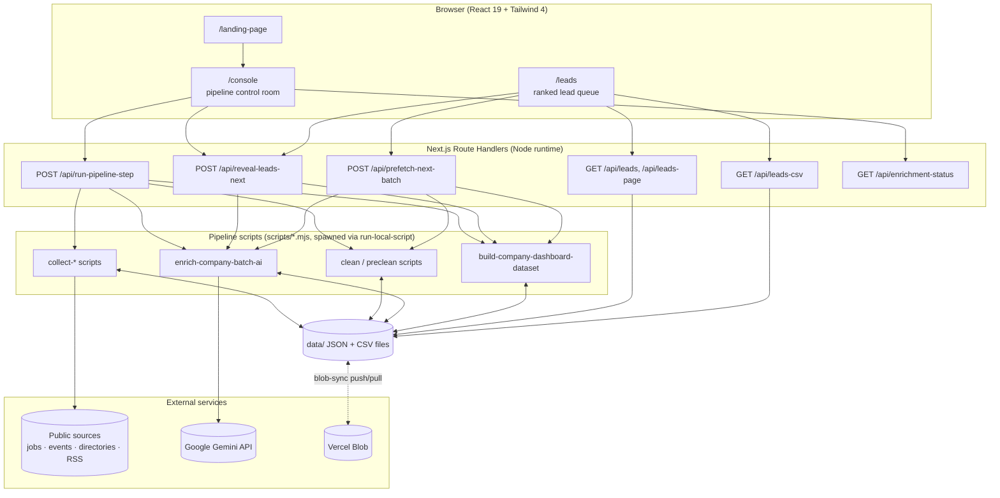
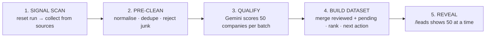
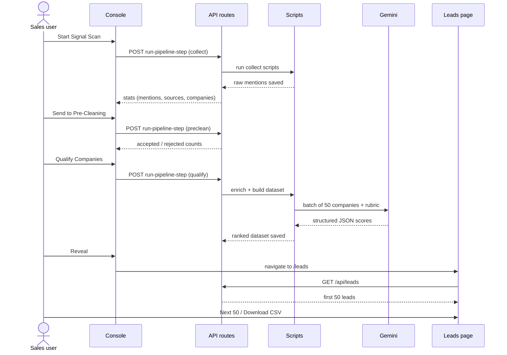

# LeadGrid — Lead Signal Intelligence

> Turn noisy public signals (job posts, startup directories, conference sponsor pages, news feeds) into a short, ranked, explainable list of companies that are **ready to buy right now**.

LeadGrid is a college project built with **Next.js 16, React 19, TypeScript and the Gemini API**. It automates the research an SDR or sales intern would otherwise do by hand — finding companies, checking whether they fit, and deciding whom to call first.

---

## 1. The Problem

Outbound sales teams and appointment-setting agencies spend most of their time *finding* leads rather than *talking* to them:

- Lead lists from paid databases are stale and generic — everyone buys the same list.
- Buying signals (a company suddenly hiring SDRs, sponsoring a SaaS conference, raising funding) are scattered across dozens of public websites.
- Raw scraped data is full of garbage: navigation labels, job titles, duplicate rows, recruiters and agencies that are *not* real buyers.
- Reps have no explanation of *why* a lead is good or *what to say* to them.

## 2. The Solution

LeadGrid runs a three-stage pipeline — **Scan → Pre-Clean → Qualify** — and presents the result as a prioritised lead queue where every lead comes with:

| Output | Example |
|---|---|
| Intent score (0–100) | `88` |
| Decision tier | `hot_lead` |
| ICP fit & confidence | `high`, `82%` |
| Why now | "Hiring 3 SDRs and sponsoring SaaStr" |
| Recommended buyer | "VP Sales / Head of Growth" |
| Next action | "Find VP Sales and test the appointment-setting pitch" |

The system is tuned for one specific seller persona: a company offering **appointment setting, SDR support, lead generation and outbound infrastructure**.

---

## 3. Use Cases

### 3.1 Primary users

| User | What they do with LeadGrid |
|---|---|
| **SDR / BDR** | Opens the queue each morning and works the hot leads from the top instead of researching from scratch. |
| **Sales manager / Head of Sales** | Checks the score breakdown and reasoning to trust the prioritisation and assign accounts. |
| **Appointment-setting agency founder** | Finds startups that *just* started hiring sales roles — the moment they are most open to outsourced outbound. |
| **Growth / marketing analyst** | Exports the queue to CSV and loads it into a CRM or outreach tool. |
| **Student / researcher** | Studies how LLMs, scraping and rule-based filtering combine into a real data product. |

### 3.2 Use-case scenarios

**UC-1 — Find companies that are hiring sales roles**
A startup posting for SDRs, AEs or a Head of Sales is building outbound capacity and often needs help. LeadGrid pulls job postings from Hacker News "Who is Hiring", RemoteOK, Remotive, Arbeitnow, Jobicy and Adzuna and surfaces those companies with the hiring evidence attached.

**UC-2 — Catch companies that are investing in growth events**
Sponsors and exhibitors of events like SaaStr Annual and Web Summit are actively spending on pipeline. LeadGrid scrapes sponsor/partner pages and flags them as high-growth accounts.

**UC-3 — Discover early-stage startups before competitors do**
Y Combinator's directory, Product Hunt and open RSS feeds reveal new and recently funded companies that are not yet in any lead database.

**UC-4 — Filter out fake or irrelevant "leads"**
Raw scraped data contains event labels ("Agenda", "Speakers"), role titles, job boards, recruiters and marketing agencies. The pre-clean stage and the AI rubric strip these so reps do not waste calls on non-buyers.

**UC-5 — Explain *why* a lead is worth contacting**
Each lead carries a score breakdown (ICP fit, outbound need, growth trigger, evidence quality, urgency, buyer clarity, penalties) and a plain-English reasoning, so the rep can defend the prioritisation and personalise the first message.

**UC-6 — Work the queue in manageable batches**
Instead of dumping thousands of rows, LeadGrid reveals **50 leads at a time**. "Next 50" unlocks the following page and, if needed, triggers another AI review batch in the background.

**UC-7 — Hand off to other tools**
One click exports the current queue to CSV for a CRM, spreadsheet or email-sequencing tool.

### 3.3 Use-case diagram



---

## 4. Key Design Features

| # | Feature | Why it matters |
|---|---|---|
| 1 | **Multi-source signal collection** | 10+ public sources across jobs, events, startup directories and RSS — no single point of failure and no paid data. |
| 2 | **Two-layer filtering** | A cheap rule-based pre-clean removes obvious garbage *before* spending LLM tokens; the LLM then makes the nuanced judgement. |
| 3 | **Transparent scoring rubric** | A fixed 0–100 rubric (ICP 25, outbound need 25, growth trigger 20, evidence 15, urgency 10, buyer clarity 5, penalty −40) makes scores explainable and consistent. |
| 4 | **Score vs. confidence separation** | A lead can have a high score but low confidence; "hot" requires score ≥ 85 **and** confidence ≥ 70. |
| 5 | **Strict ICP guardrails** | Agencies, staffing firms, job boards and B2C brands are explicitly demoted so the queue stays relevant. |
| 6 | **Structured LLM output** | Gemini is prompted for a strict JSON schema, repaired with `jsonrepair`, and validated/normalised before use — the UI never trusts raw model text. |
| 7 | **Batching with recursive retry** | Companies are reviewed 50 at a time; if a batch fails, it is split in half and retried, isolating bad rows. |
| 8 | **Fresh-run guarantee** | Every scan creates a new `runId` and clears previous results, so the queue is never secretly built from stale data. |
| 9 | **Paginated "reveal" model** | Keeps the UI focused and spreads LLM cost over time instead of scoring everything upfront. |
| 10 | **Pending leads stay visible** | Not-yet-reviewed companies appear after reviewed ones with a heuristic score, so the queue never collapses to a handful of rows. |
| 11 | **Dual storage backends** | Local `data/` folder in development; Vercel Blob sync in production, where the serverless filesystem is ephemeral. |
| 12 | **Non-technical UX language** | The console shows "Signal Scan / Pre-Clean / Intent Score" — never "scripts" or "Gemini". |

---

## 5. System Architecture

### 5.1 High-level view



### 5.2 Layers

| Layer | Responsibility | Where |
|---|---|---|
| **Presentation** | Landing page, pipeline console with live progress cards, lead queue with score breakdown | `app/landing-page`, `app/console`, `app/leads`, `components/LeadDashboard.tsx` |
| **API** | Thin HTTP layer: trigger a pipeline step, return paged leads, advance the reveal state, export CSV | `app/api/*/route.ts` |
| **Orchestration** | Spawns pipeline scripts as child processes with timeouts | `lib/run-local-script.ts` |
| **Pipeline workers** | Collect, clean, enrich and build the dataset | `scripts/*.mjs` |
| **Domain logic** | Typed models plus rule-based identity resolution, qualification and intent scoring | `types/company.ts`, `lib/identity.ts`, `lib/qualification.ts`, `lib/intent.ts` |
| **Persistence** | Flat JSON/CSV files, optionally mirrored to Vercel Blob | `data/`, `scripts/blob-sync.mjs`, `scripts/data-dir.mjs` |

### 5.3 Why these design choices?

- **File-based storage instead of a database** — a POC has one user and one run at a time; JSON/CSV files are inspectable, diff-able and need no setup. Blob sync covers deployment.
- **Scripts behind API routes** — each stage is an independent, re-runnable script that can also be run from the terminal, which makes debugging and demos easy.
- **LLM for judgement, rules for hygiene** — rules are cheap and deterministic for obvious junk; an LLM is better at "is this a real buyer and do they need outbound help?".
- **Step-by-step API** — the console calls one step at a time so each stage fits within serverless time limits (`vercel.json` sets `maxDuration: 60`) and the UI can show real progress.

---

## 6. Data Pipeline (Workflow)



| Stage | Input | What happens | Output |
|---|---|---|---|
| **1. Signal Scan** | Public websites & APIs | New `runId` created, old results cleared; sources collected as *raw mentions* | `real-source-mentions.json` |
| **2. Pre-Clean** | Raw mentions | Drop missing/too-short names, exact duplicates, event/navigation labels, rows with no evidence. Rejected rows are kept for audit. | `…-preclean.json`, `…-rejected-preclean.json` |
| **3. Qualify** | Clean mentions grouped by company | Gemini resolves the real entity, extracts buying signals, scores against the rubric, assigns a decision, why-now, buyer and next action | `ai-enriched-company-leads.json` |
| **4. Build dataset** | AI results + unreviewed companies | Reviewed leads ranked by score; pending leads get a heuristic score (capped at 60); trash removed; next-action text generated | `company-dashboard-leads.json` |
| **5. Reveal** | Ranked dataset | Shows first 50; "Next 50" unlocks more and pre-fetches the next AI batch | `leadgrid-visible-state.json` |

### Decision tiers

| Tier | Meaning | Typical score |
|---|---|---|
| 🔥 `hot_lead` | Clear need, strong evidence, good ICP fit — contact now | ≥ 85 (and confidence ≥ 70) |
| `warm_lead` | Useful evidence, worth outreach | 70–84 |
| `nurture` | Possible fit, keep warm | 45–69 |
| `research_more` | Weak or incomplete evidence | < 45 |
| `not_relevant` / `trash` | Real but wrong buyer / not a company | hidden from queue |

### Signal sources

| Category | Sources |
|---|---|
| **Jobs** | Hacker News "Who is Hiring", RemoteOK, Remotive, Arbeitnow, Jobicy, Adzuna |
| **Events** | SaaStr Annual, Web Summit partner pages, other SaaS conference sponsor/exhibitor pages |
| **Startup directories** | Y Combinator company directory, Product Hunt |
| **Open RSS feeds** | Funding/startup news feeds listed in `data/open-lead-rss-sources.json` |

---

## 7. Sales-Intent Scoring Model

```text
intentScore =  icpFit            (0–25)
             + outboundNeed      (0–25)
             + growthTrigger     (0–20)
             + evidenceQuality   (0–15)
             + urgency           (0–10)
             + buyerClarity      (0–5)
             + negativePenalty   (0 to −40)
             → clamped to 0–100
```

Separately, the model returns a **confidence** (0–100): strong direct evidence (80+), partial (50–79), weak (20–49), likely bad entity (<20).

The repository also contains an earlier **deterministic, rule-based** version of this idea (`lib/qualification.ts` and `lib/intent.ts`): keyword checks for B2B/SaaS/sales-motion, hiring of SDR/AE/VP Sales roles, funding, conference and accelerator presence, multi-source validation and activity recency. It is the conceptual baseline the AI rubric improves on.

---

## 8. Screens

| Route | Purpose |
|---|---|
| `/` | Redirects to `/landing-page` |
| `/landing-page` | Product introduction with an **Open App** call-to-action |
| `/console` | Control room: **Start Signal Scan → Send to Pre-Cleaning → Qualify Companies → Reveal**, with live counters for each stage |
| `/leads` | Ranked lead cards (score, tier, reasoning, buyer, next action), **Next 50**, **Download CSV** |

### End-to-end user journey



---

## 9. API Summary

| Endpoint | Purpose |
|---|---|
| `POST /api/run-pipeline-step` | Runs one stage: `collect_sources`, `collect_extra`, `collect_saas`, `preclean`, `qualify` |
| `GET /api/leads`, `GET /api/leads-page` | Returns the visible / paged lead queue |
| `POST /api/reveal-leads-next` | Unlocks the next 50 leads (runs another AI batch if the queue is nearly exhausted) |
| `POST /api/prefetch-next-batch` | Background pre-clean + enrich + build, guarded by a lock file |
| `GET /api/enrichment-status` | Progress of the AI review |
| `GET /api/leads-csv` | CSV export of the queue |

Legacy/single-purpose routes `run-signal-scan`, `run-preclean`, `run-qualification` and `enrich-next-batch` are also present.

---

## 10. Tech Stack

| Area | Technology |
|---|---|
| Framework | Next.js 16 (App Router, Route Handlers), React 19 |
| Language | TypeScript, Node.js ESM scripts |
| Styling | Tailwind CSS 4 |
| AI | Google Gemini via `@google/genai` |
| Data handling | PapaParse (CSV), jsonrepair, Zod |
| Storage | Local JSON/CSV files, Vercel Blob (`@vercel/blob`) |
| Hosting | Vercel (function `maxDuration` set in `vercel.json`) |

---

## 11. Project Structure

```text
Leadgrid/
├── app/
│   ├── landing-page/      # marketing entry page
│   ├── console/           # pipeline control room
│   ├── leads/             # lead queue UI
│   └── api/               # route handlers
├── components/            # LeadDashboard
├── lib/                   # rule-based qualification, intent, identity, script runner
├── scripts/               # collectors, cleaners, AI enrichment, dataset builder, blob sync
├── types/                 # shared TypeScript models
├── data/                  # generated JSON/CSV (per-run)
└── docs/TECHNICAL_NOTES.md  # detailed implementation notes
```

---

## 12. Getting Started

```bash
npm install
cp .env.example .env.local      # add GEMINI_API_KEY
npm run dev                     # http://localhost:3000
```

Then open `/console` and click **Start Signal Scan → Send to Pre-Cleaning → Qualify Companies → Reveal**.

Key environment variables:

| Variable | Purpose |
|---|---|
| `GEMINI_API_KEY` | Gemini access for AI qualification |
| `GEMINI_MODEL` / `AI_MODEL` | Model selection (scripts default to `gemini-2.5-flash-lite`) |
| `LEADGRID_DATA_DIR` | Where pipeline files are written (`/tmp/leadgrid-data` on Vercel) |
| `BLOB_READ_WRITE_TOKEN`, `LEADGRID_BLOB_PREFIX` | Vercel Blob persistence in production |

---

## 13. Limitations & Future Scope

**Current limitations**
- Single-user, single-run design; no authentication or multi-tenant storage.
- Flat files instead of a database; concurrent runs are guarded only by lock files.
- Scrapers depend on public page structure and may break when sites change.
- Lead quality depends on LLM judgement; no human feedback loop yet.
- Only contact *roles* are recommended — no individual contact enrichment.

**Future scope**
- Database (Postgres) with per-user workspaces and saved run history.
- Contact enrichment (LinkedIn/email discovery) and CRM integrations (HubSpot, Salesforce).
- Feedback loop: reps mark leads won/lost to calibrate the rubric.
- Scheduled scans and alerts when a watched company shows a new signal.
- Configurable ICP so non-outbound sellers can reuse the same engine.

---

*Detailed implementation notes (file-by-file behaviour, data files, route internals) are in [`docs/TECHNICAL_NOTES.md`](docs/TECHNICAL_NOTES.md).*
